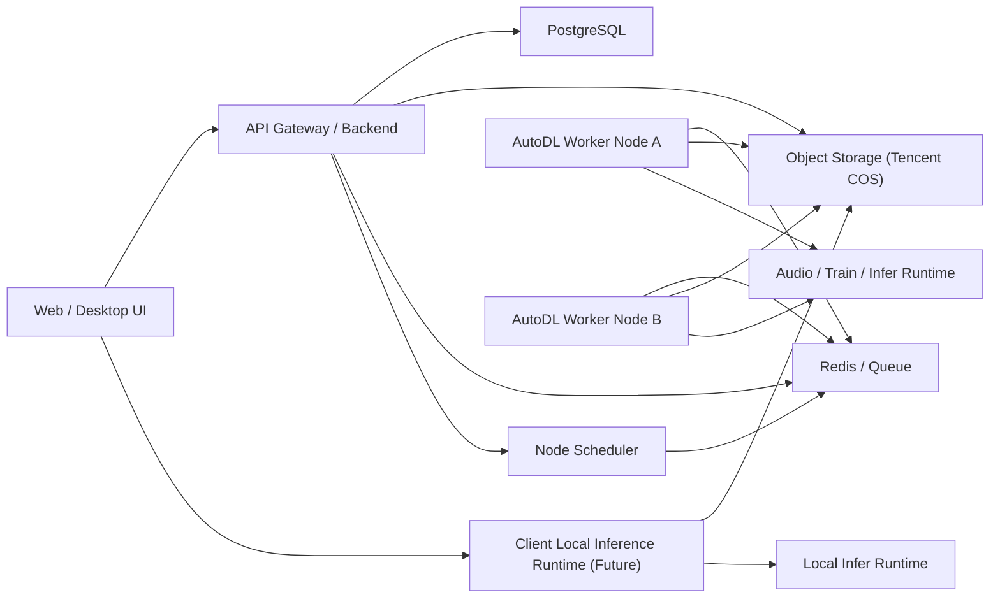

# AI 音频角色训练与推理平台方案

## 1. 目标

构建一套面向 AI 音频自媒体的统一平台，解决以下问题：

- 统一 `角色音频素材整理 -> 数据提纯 -> RVC 训练 -> 模型管理 -> 推理生成 -> 内容生产` 的工作流
- 音频处理与训练统一运行在 `AutoDL` 等 GPU 执行节点，推理支持 `云端执行` 和未来 `客户端本地执行` 两种模式
- 建立可复用的 `角色音频库`、`模型库`、`项目库`
- 网站端先落地，后续可以平滑迁移为桌面客户端

## 2. 核心原则

- 控制与执行解耦：控制平面轻量稳定，执行平面可弹性扩缩
- 数据先行：角色素材、切片、标注、模型权重都必须可追踪
- 工作流自动化：尽量用队列任务串联，不靠手工脚本拼接
- 人工审核兜底：音频提纯无法 100% 自动，平台要保留人工筛选入口
- 客户端友好：架构从一开始就避免把核心逻辑绑死在 Web 页面里

## 3. 你现在的业务闭环

建议把业务拆成 5 个子系统：

1. `素材采集系统`
   负责导入原始视频、音频、直播切片、配音片段。

2. `音频处理系统`
   负责分离人声、降噪、静音切分、说话人分离、文本转写、质量评分。

3. `训练与推理执行系统`
   负责把清洗、训练任务下发到 AutoDL，并支持推理任务按策略分发到 `AutoDL` 或 `客户端本地执行器`。

4. `节点调度系统`
   负责维护可用 AutoDL 节点、心跳状态、抢占任务、失败重试和资源统计。

5. `资产管理系统`
   负责角色库、数据集、模型版本、推理预设、项目记录、生成记录。

## 4. 推荐的总体架构



### 4.1 模块职责

`Web / Desktop UI`

- 角色库管理
- 音频上传与审核
- 训练任务发起
- 模型版本管理
- 推理任务配置与试听

`Backend API`

- 用户、角色、数据集、模型、项目的统一 API
- 任务编排和状态管理
- 文件元数据管理

`Node Scheduler`

- 维护节点注册、心跳、租期、忙闲状态
- 负责任务投递策略、超时回收、失败重试
- 统计当前可用 AutoDL 节点和可执行能力

`AutoDL Worker`

- 节点启动后主动拉取任务
- 执行音频处理、训练、推理
- 上传输出文件、日志、指标和状态

`Client Local Inference Runtime`

- 未来桌面客户端中的本地推理执行器
- 只承担 `infer` 任务，不承担 `process` 和 `train`
- 拉取模型、执行本地推理、上报状态和上传成品

## 5. 推荐技术栈

## 5.1 前端

- `Next.js`：先做 Web 管理台，开发效率高
- `Tailwind CSS + shadcn/ui`：快速搭管理后台
- `WaveSurfer.js`：做音频波形、切片审核、片段试听

## 5.2 后端

- `FastAPI`：适合音频、训练、推理任务型系统
- `SQLAlchemy + PostgreSQL`：关系型数据管理稳定
- `Redis + Celery / RQ`：异步任务队列
- `Tencent COS`：作为统一对象存储，兼容 S3 协议，后端通过 S3 抽象接入
- `WebSocket / Server-Sent Events`：向前端推送任务状态变化

## 5.3 音频处理

- `FFmpeg`：转码、采样率统一、切片
- `Ultimate Vocal Remover / Demucs`：做人声分离
- `DeepFilterNet`：做环境噪声抑制
- `Silero VAD`：做语音活动检测，删除静音和无效段
- `WhisperX`：转写和对齐
- `pyannote.audio`：说话人分离，尽量提取目标角色单人段落

部署建议：

- 音频处理不再放在轻量服务器，统一由 `AutoDL Worker` 执行
- `AutoDL Worker` 支持三类任务：`process`、`train`、`infer`
- `客户端本地执行器` 只支持 `infer`
- 轻量服务器只保留 API、数据库、队列、节点状态和调度逻辑

## 5.4 训练与推理

- `RVC WebUI / RVC 推理脚本`：核心训练和推理引擎
- `FAISS 索引`：按 RVC 标准保留检索特征
- `Docker`：统一 AutoDL worker 执行环境

## 5.5 客户端迁移

- `Tauri`：后续桌面端优先选它，体积小，适合包一层 UI
- 继续复用现有 `FastAPI + 调度服务 + AutoDL worker API`

说明：
网站阶段不要把执行逻辑写死在前端。核心能力放在 API、调度服务和执行器中，后续客户端除了更换 UI 壳，还可以补上本地推理能力。

## 6. 统一工作流设计

## 6.1 素材入库

支持 4 类输入：

- 上传本地音频
- 上传本地视频，自动抽音轨
- 导入已有角色语音包
- 批量导入项目素材

入库后立刻生成：

- 原始文件记录
- 音频指纹
- 时长、采样率、声道、响度等元信息

## 6.2 音频提纯流程

建议采用 `多阶段清洗`，不要只依赖单一降噪模型。

### 第一层：人声分离

目标是把 BGM、音效、环境底噪尽量去掉，保留主人声。

流程：

1. 原始音频统一转为 `mono / 44.1k 或 48k / wav`
2. 使用 `Demucs` 或 `UVR` 做人声分离
3. 同时保留：
   - 原音轨
   - 分离后人声轨
   - 残差轨

这样后续可人工对比，避免一次处理把音色搞坏。

### 第二层：降噪与去环境音

对分离后的人声轨继续处理：

1. 使用 `DeepFilterNet` 去连续背景噪声
2. 使用高通/低通和响度标准化做基础后处理
3. 对过度失真的片段直接打低分，不纳入训练集

注意：
过强降噪会破坏角色音色细节。对 RVC 来说，轻度底噪往往比“被算法抹平的人声”更可接受。

### 第三层：语音切分

1. 使用 `Silero VAD` 去掉静音、呼吸过长段、纯环境音
2. 按时长切成 `3-12 秒` 的训练片段
3. 过滤过短、过长、过小声片段

### 第四层：说话人分离

如果素材来自动画、访谈、直播、混剪，常见问题是多人混说。

处理方式：

1. 用 `pyannote.audio` 先做 diarization
2. 按 speaker 聚类
3. 人工把某个 cluster 标记为“目标角色”
4. 后续同角色新素材可复用这个聚类策略

这一步不能完全自动化，但能把人工成本从“逐段听”降到“逐簇审核”。

### 第五层：文本转写与质量评分

1. 用 `WhisperX` 转写文本
2. 计算每段质量分数：
   - 信噪比
   - 人声音量稳定性
   - 是否多人重叠
   - 是否有明显 BGM 泄漏
   - 是否过饱和/爆音
3. 只把高质量片段推进训练集候选区

最终形成三层数据：

- `raw`：原始素材
- `processed`：算法清洗后素材
- `approved`：人工审核通过，可训练素材

## 7. 角色音频库怎么建

角色库不要只存一个“角色名字”，而要做成结构化资产库。

### 7.1 角色实体

每个角色建议包含：

- 角色名
- 来源作品
- 语言
- 性别/音色标签
- 年龄感标签
- 情绪标签
- 版权备注
- 默认参考图
- 默认训练配置

### 7.2 素材实体

每条素材记录：

- 来源文件
- 来源章节/视频
- 是否官方音频
- 是否多人混说
- 是否有背景音乐
- 清洗版本列表
- 审核状态
- 可训练状态

### 7.3 片段实体

每个切片记录：

- 所属角色
- 文本内容
- 时长
- 质量分
- speaker cluster
- 噪声等级
- 是否推荐训练

### 7.4 模型实体

每个模型记录：

- 角色 ID
- 训练数据版本
- RVC 参数
- 训练轮次
- 采样率
- 索引文件
- 模型权重
- 验证音频
- 主观评分
- 是否为生产版本

## 8. AutoDL 统一执行方案

你的约束已经调整为：`音频处理` 和 `训练` 固定放在 AutoDL，`推理` 既可以放在 AutoDL，也可以在未来由客户端本地执行。轻量服务器只做控制平面，所以整套系统必须采用 `执行器主动拉取任务` 的模式，而不是手工 SSH 或服务器主动推脚本。

### 8.1 推荐做法

把所有执行过程包装成 `统一任务协议 + 执行器`：

1. 本地/网站发起训练任务
2. 后端把输入素材或数据集上传到对象存储
3. 调度器创建任务记录并放入队列
4. 执行器启动后主动上报能力与状态：
   - 节点 ID
   - 节点类型
   - GPU 型号
   - 显存
   - 支持任务类型
   - 当前忙闲状态
   - 最近心跳时间
5. 空闲执行器从队列拉取匹配任务
6. 执行器执行对应任务：
   - `process`：音频提纯、切片、转写、质量评分
   - `train`：RVC 训练与索引生成
   - `infer`：模型推理与成品生成
7. 执行完成后上传：
   - `model.pth`
   - `index`
   - `config`
   - `train log`
   - `sample preview`
   - `processed audio`
   - `inference output`
8. 后端更新任务状态与资产记录

### 8.2 Worker 环境建议

- 用固定 `Docker image`
- 固定 Python、CUDA、PyTorch、RVC 依赖版本
- 所有任务参数写入 `job_manifest.json`

这样才能做到：

- 可复现
- 可回滚
- 可比较不同训练参数的效果

### 8.3 执行器注册与心跳机制

每个执行器启动后先执行：

1. `register`
2. 拉取配置和运行时版本
3. 进入 `heartbeat + pull loop`

建议心跳字段：

- `node_id`
- `node_type`       # autodl / client-local
- `hostname`
- `provider`
- `gpu_name`
- `gpu_count`
- `vram_mb`
- `status`
- `running_job_id`
- `supported_job_types`
- `last_seen_at`
- `worker_version`

建议状态：

- `offline`
- `idle`
- `busy`
- `draining`
- `error`

建议规则：

- `30 秒` 一次 heartbeat
- 超过 `90 秒` 未上报则判定为离线
- 节点拉到任务后先申请租期，避免重复消费
- 任务超时后由调度器回收并重新入队

### 8.4 任务最少字段

- `character_id`
- `job_type`
- `execution_mode`   # cloud / local / auto
- `priority`
- `input_asset_ids`
- `dataset_version`
- `model_version`
- `sample_rate`
- `f0_method`
- `batch_size`
- `total_epoch`
- `speaker_id`
- `retry_count`
- `note`

## 9. 调度与状态机设计

核心思路是：服务器只知道“有什么任务”和“当前有什么执行器”，真正的执行细节交给 worker 或未来客户端本地执行器。

### 9.1 任务状态

- `pending`
- `queued`
- `leased`
- `running`
- `uploading`
- `succeeded`
- `failed`
- `retry_waiting`
- `cancelled`

### 9.2 节点调度规则

- 优先把 `train` 派给显存更高的节点
- `process` 可派给中低配 GPU 节点
- `infer` 在 `execution_mode=cloud` 时派给 AutoDL 节点
- `infer` 在 `execution_mode=local` 时只派给当前登录用户的客户端本地执行器
- `infer` 在 `execution_mode=auto` 时可按成本、排队长度和节点可用性自动选择云端或本地
- 同一角色的连续任务尽量调度到同一节点，减少模型与缓存重复加载

### 9.3 为什么要用拉模式

因为 AutoDL 节点具有明显的临时性：

- 你可能手动开关机
- 节点 IP 可能变化
- 节点存活时间不稳定
- 节点数量会动态变化

用 `worker 主动拉任务` 比 `服务器主动推任务` 稳定得多，也更容易处理断线重连。

## 10. 网站端功能模块

建议分成 7 个页面模块：

### 10.1 仪表盘

- 今日处理素材数
- 待审核片段数
- 训练中任务
- 可用模型数
- 当前在线 AutoDL 节点数
- 各节点忙闲状态和可执行能力

### 10.2 角色库

- 新建角色
- 查看角色素材
- 查看角色模型版本
- 试听和对比不同模型

### 10.3 素材处理台

- 上传原始音频/视频
- 启动提纯流程
- 查看波形
- 审核切片
- 标记“可训练 / 不可训练”

### 10.4 训练中心

- 发起训练
- 查看远端训练日志
- 查看模型指标
- 发布模型版本

### 10.5 推理中心

- 上传待转换音频
- 选择角色模型
- 选择执行方式：`云端` / `本地` / `自动`
- 调整参数
- 批量推理
- 下载成品

### 10.6 节点中心

- 查看 AutoDL 节点在线状态
- 查看节点 GPU 和显存信息
- 查看当前运行任务
- 手动将节点切换为 `draining`
- 查看节点失败日志

### 10.7 预设中心

- 保存常用推理参数
- 保存不同角色的最佳预设

### 10.8 项目中心

- 一个视频项目绑定多个原始音频、多个角色模型和多个输出版本

## 11. 数据库核心表设计

最少需要这些表：

- `users`
- `characters`
- `character_aliases`
- `media_assets`
- `audio_process_jobs`
- `audio_segments`
- `segment_reviews`
- `datasets`
- `dataset_segments`
- `training_jobs`
- `model_versions`
- `inference_jobs`
- `inference_presets`
- `worker_nodes`
- `worker_heartbeats`
- `job_leases`
- `client_runtimes`
- `projects`
- `project_assets`

其中最关键的关系是：

- `character -> media_assets -> audio_segments`
- `character -> datasets -> training_jobs -> model_versions`
- `project -> inference_jobs -> outputs`
- `worker_nodes -> job_leases -> jobs`

## 12. 后续迁移到客户端的建议

推荐路线：

### 第一阶段

先做 `Web + 调度服务 + AutoDL worker`

优点：

- 开发快
- 方便你自己先跑通流程
- 后台任务和数据库先稳定

### 第二阶段

新增 `Tauri Desktop`

桌面端只做：

- UI
- 本地文件选择
- 本地推理执行器
- 登录和同步

核心后端和数据结构不变。

### 第三阶段

支持离线模式：

- 本地 SQLite / LiteFS
- 本地文件系统缓存或轻量对象缓存
- 本地任务队列

这样就能做成真正的生产型客户端。

## 13. MVP 建议

先不要一口气做全套，第一版只做最关键闭环。

### MVP 范围

1. 角色管理
2. 音频上传
3. 一键音频提纯
4. 切片审核
5. 发起 AutoDL 训练
6. 模型版本入库
7. 发起云端推理
8. 推理结果下载

### MVP 暂时不做

- 多用户权限
- 复杂协作
- 自动版权检测
- 手机端
- 全自动角色识别
- 客户端本地推理

## 14. 推荐开发顺序

### 阶段 A：先打通底座

1. 初始化 monorepo
2. 建后端 API
3. 建数据库和对象存储
4. 建调度服务和 AutoDL worker

### 阶段 B：做素材处理闭环

1. 上传音频/视频
2. 人声分离
3. 降噪
4. 切片
5. 审核界面

### 阶段 C：做训练闭环

1. 数据集版本化
2. AutoDL 训练任务编排
3. 模型回传
4. 模型试听与发布

### 阶段 D：做内容生产闭环

1. 推理任务
2. 预设
3. 批量生成
4. 项目管理

## 15. 你最关心的两个问题，直接结论

### 15.1 工作流太复杂，没有统一工具

结论：
不要试图找一个现成软件把所有事情都包掉，而是自己做一个 `平台壳`，把底层工具服务化和任务化。

统一的不是“算法本体”，而是：

- 数据流
- 任务流
- 模型流
- 审核流
- 节点流

### 15.2 角色音频很难获取，能不能提纯

结论：
可以提纯，而且必须做多阶段提纯，但要接受一个现实：

- 可以显著降低背景音和多人混说问题
- 不能把很差的素材神奇变成高质量训练集

真正有效的方案不是“强力降噪一次完成”，而是：

- 先分离
- 再降噪
- 再切分
- 再说话人聚类
- 最后人工审核

## 16. 具体实施建议

建议仓库从一开始就按下面结构组织：

```text
apps/
  web/
  api/
  scheduler/
  desktop/           # 第二阶段再启用
services/
  autodl-worker/
  training-orchestrator/
packages/
  shared-types/
  ui/
  audio-pipeline/
infra/
  docker/
  autodl/
docs/
```

## 17. 风险与注意事项

- 角色配音和角色音色克隆涉及版权、人格权、平台政策，发布前要单独做合规评估
- 动画、游戏、影视角色的训练素材质量决定上限，算法只能尽量提纯
- AutoDL 训练环境若不版本固定，后面会很难复现
- AutoDL 节点频繁上下线时，必须做好心跳超时、租期回收和幂等重试
- 同一个任务重复执行时要通过输出路径和任务幂等键避免脏数据

## 18. 下一步建议

如果按最稳妥的路线，下一步建议直接做三件事：

1. 确定 monorepo 技术栈和目录结构
2. 定义数据库表和对象存储目录规范
3. 先实现 `节点注册 -> 心跳 -> 拉任务 -> 上报状态`

这条链路跑通后，再接 `音频处理 -> 训练 -> 推理` 三类任务，成功率最高。

## 19. 参考工具与项目

- RVC: https://github.com/RVC-Project/Retrieval-based-Voice-Conversion-WebUI
- UVR: https://github.com/Anjok07/ultimatevocalremovergui
- Demucs: https://github.com/facebookresearch/demucs
- WhisperX: https://github.com/m-bain/whisperX
- Silero VAD: https://github.com/snakers4/silero-vad
- DeepFilterNet: https://github.com/Rikorose/DeepFilterNet
- pyannote.audio: https://github.com/pyannote/pyannote-audio
