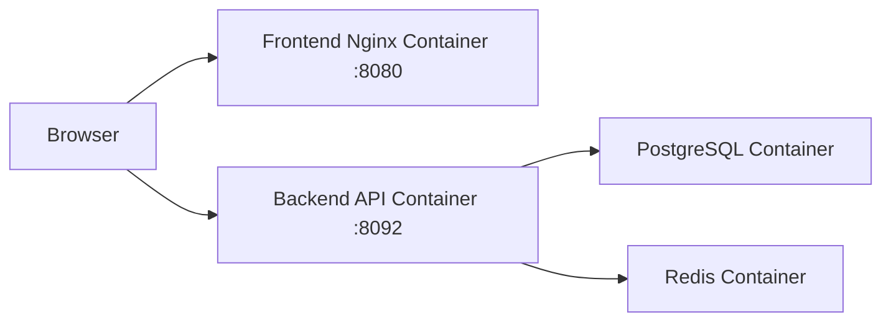

# 阿里云简单部署文档

## 1. 目标

本文档按你现在确认的部署方式编写：

- 后端使用 `Docker` 容器部署
- 前端使用 `Nginx` 容器部署
- 数据库和 Redis 已经由你原来的 Docker 环境提供
- 复用现有 Docker 网络：`life-tool_default`
- 前后端端口都直接暴露到外部访问

这版方案适合先做联调和测试，不追求最严密的生产隔离。

## 2. 部署拓扑



说明：

- 前端容器对外暴露 `8080`
- 后端容器对外暴露 `8092`
- 后端通过 `life-tool_default` 连接 PostgreSQL / Redis 容器
- 前端构建时直接写入后端外网地址，例如 `http://your-server-ip:8092`

## 3. 服务器建议

测试环境建议：

- `ECS`
- `2 vCPU / 4 GB` 起步
- `Ubuntu 22.04`
- `40 GB` 系统盘起

如果你这台机子上还跑 `life-tool` 的其他服务，建议：

- `4 vCPU / 8 GB`

## 4. 安全组和端口

当前方案建议开放：

- `22`
- `8080`  前端
- `8092`  后端

如果你后面要挂域名反代，再开放：

- `80`
- `443`

数据库和 Redis 端口原则上不要对公网开放：

- `5432`
- `6379`

## 5. 基础环境

登录 ECS 后执行：

```bash
sudo apt update
sudo apt install -y curl git unzip
```

确认 Docker：

```bash
docker --version
docker compose version
```

如果没装 Docker：

```bash
curl -fsSL https://get.docker.com | sudo sh
sudo usermod -aG docker $USER
newgrp docker
docker --version
```

## 6. 拉取项目

```bash
sudo mkdir -p /srv/ai-music
sudo chown -R $USER:$USER /srv/ai-music
cd /srv/ai-music
git clone git@github.com:xiaosenho/ai-music.git .
```

## 7. 确认现有 Docker 网络

你已经指定要复用：

- `life-tool_default`

先确认它存在：

```bash
docker network ls | grep life-tool_default
```

如果没有输出，说明当前服务器上还没有这个 network，需要先启动你原来的 `life-tool` 数据库环境，或者手动创建同名网络：

```bash
docker network create life-tool_default
```

再确认 PostgreSQL / Redis 所在容器已经在这个网络里：

```bash
docker inspect <postgres-container-name>
docker inspect <redis-container-name>
```

你需要明确这两个容器在 network 内可访问的名称，例如：

- PostgreSQL: `postgres`
- Redis: `redis`

如果实际不是这两个名字，后面的后端环境变量要改成你自己的名字。

## 8. 后端部署

## 8.1 后端环境变量

项目里我已经给你准备了模板：

- [backend.app.env.example](/mnt/c/Users/hello/OneDrive/文档/ai-music/deploy/aliyun/backend.app.env.example:1)

在服务器上创建真实配置：

```bash
cd /srv/ai-music/deploy/aliyun
cp backend.app.env.example backend.app.env
nano backend.app.env
```

你最需要确认的是这几项：

```bash
SPRING_DATASOURCE_URL=jdbc:postgresql://postgres:5432/aimusic
SPRING_DATA_REDIS_HOST=redis
SPRING_DATA_REDIS_PORT=6379
```

如果你数据库容器名不是 `postgres`，Redis 容器名不是 `redis`，这里一定要改成真实可解析的容器名。

## 8.2 后端 compose 文件

项目里已准备好：

- [docker-compose.prod.yml](/mnt/c/Users/hello/OneDrive/文档/ai-music/deploy/aliyun/docker-compose.prod.yml:1)

其中后端服务特点：

- 暴露 `8092:8092`
- 加入 `life-tool_default`
- 从 `backend.app.env` 读取环境变量
- 支持可选 `MAVEN_MIRROR_URL` 构建参数，用来加速 Maven 依赖下载

## 8.3 启动后端

```bash
cd /srv/ai-music/deploy/aliyun
cp .env.example .env
nano .env
```

建议确认这一项保留为国内镜像：

```bash
MAVEN_MIRROR_URL=https://maven.aliyun.com/repository/public
```

然后使用 BuildKit 构建后端：

```bash
DOCKER_BUILDKIT=1 docker compose -f docker-compose.prod.yml up -d --build api
```

查看状态：

```bash
docker compose -f docker-compose.prod.yml ps
docker logs -f ai-music-api
```

## 8.4 验证后端

```bash
curl http://127.0.0.1:8092/actuator/health
curl http://127.0.0.1:8092/api/v1/dashboard/summary
```

再从外网验证：

```bash
curl http://your-server-ip:8092/actuator/health
```

## 9. 前端 Nginx 容器部署

## 9.1 前端构建方式

前端现在不是宿主机 Nginx 托管，而是：

- `React/Vite` 构建
- 打进 `Nginx` 容器镜像
- 容器对外暴露端口

相关文件我已经放好了：

- [apps/web/Dockerfile](/mnt/c/Users/hello/OneDrive/文档/ai-music/apps/web/Dockerfile:1)
- [apps/web/nginx.conf](/mnt/c/Users/hello/OneDrive/文档/ai-music/apps/web/nginx.conf:1)

## 9.2 前端环境变量

在服务器上编辑：

```bash
cd /srv/ai-music/deploy/aliyun
cp .env.example .env
nano .env
```

重点字段：

```bash
FRONTEND_PORT=8080
BACKEND_PORT=8092
VITE_API_BASE_URL=http://your-server-ip:8092
```

说明：

- `FRONTEND_PORT` 是前端容器对外端口
- `BACKEND_PORT` 是后端容器对外端口
- `VITE_API_BASE_URL` 会在前端镜像构建时写入

如果你已经有域名，也可以直接写：

```bash
VITE_API_BASE_URL=https://api.your-domain.com
```

或者如果前后端同域只是端口不同：

```bash
VITE_API_BASE_URL=http://your-domain.com:8092
```

## 9.3 启动前端

```bash
cd /srv/ai-music/deploy/aliyun
DOCKER_BUILDKIT=1 docker compose -f docker-compose.prod.yml up -d --build web
```

查看：

```bash
docker logs -f ai-music-web
docker compose -f docker-compose.prod.yml ps
```

## 9.4 验证前端

本机测试：

```bash
curl http://127.0.0.1:8080
```

外网测试：

- `http://your-server-ip:8080`

## 10. 一次启动前后端

如果你已经把 `.env` 和 `backend.app.env` 都配好了，可以直接：

```bash
cd /srv/ai-music/deploy/aliyun
DOCKER_BUILDKIT=1 docker compose -f docker-compose.prod.yml up -d --build
```

## 11. 文件说明

这次部署相关文件如下：

- [deploy/aliyun/docker-compose.prod.yml](/mnt/c/Users/hello/OneDrive/文档/ai-music/deploy/aliyun/docker-compose.prod.yml:1)
- [deploy/aliyun/.env.example](/mnt/c/Users/hello/OneDrive/文档/ai-music/deploy/aliyun/.env.example:1)
- [deploy/aliyun/backend.app.env.example](/mnt/c/Users/hello/OneDrive/文档/ai-music/deploy/aliyun/backend.app.env.example:1)
- [apps/web/Dockerfile](/mnt/c/Users/hello/OneDrive/文档/ai-music/apps/web/Dockerfile:1)
- [apps/web/nginx.conf](/mnt/c/Users/hello/OneDrive/文档/ai-music/apps/web/nginx.conf:1)

## 12. 部署后测试

## 12.1 访问测试

前端：

- `http://your-server-ip:8080`

后端：

- `http://your-server-ip:8092/actuator/health`
- `http://your-server-ip:8092/api/v1/dashboard/summary`

## 12.2 创建任务测试

```bash
curl -X POST http://your-server-ip:8092/api/v1/jobs \
  -H 'Content-Type: application/json' \
  -d '{
    "jobType":"PROCESS",
    "executionMode":"CLOUD",
    "priority":1,
    "inputAssetIds":["asset-001"],
    "note":"aliyun smoke test"
  }'
```

## 12.3 注册 worker 测试

```bash
curl -X POST http://your-server-ip:8092/api/v1/workers/register \
  -H 'Content-Type: application/json' \
  -d '{
    "nodeType":"AUTODL",
    "hostname":"autodl-test-01",
    "provider":"autodl",
    "gpuName":"RTX 4090",
    "gpuCount":1,
    "vramMb":24576,
    "supportedJobTypes":["PROCESS","TRAIN","INFER"],
    "workerVersion":"0.0.1",
    "status":"IDLE"
  }'
```

## 13. 更新流程

拉新代码：

```bash
cd /srv/ai-music
git pull
```

更新后端：

```bash
cd /srv/ai-music/deploy/aliyun
DOCKER_BUILDKIT=1 docker compose -f docker-compose.prod.yml up -d --build api
```

更新前端：

```bash
cd /srv/ai-music/deploy/aliyun
DOCKER_BUILDKIT=1 docker compose -f docker-compose.prod.yml up -d --build web
```

如果前端 API 地址改了，记得重新构建 `web`。

## 14. 常见问题

### 14.1 后端容器起不来

先看：

```bash
docker logs -f ai-music-api
```

重点看：

- PostgreSQL 主机名是否正确
- Redis 主机名是否正确
- `life-tool_default` 是否存在
- 后端容器是否真的加入了这个网络

如果是“构建特别慢”，常见原因是：

- 第一次构建需要拉取 Maven 基础镜像和所有依赖
- 没有开启 `DOCKER_BUILDKIT=1`
- `.env` 里没有配置 `MAVEN_MIRROR_URL`
- Docker 构建缓存被清掉了

### 14.2 后端连不上数据库

通常是：

- `SPRING_DATASOURCE_URL` 写错
- 数据库容器不在 `life-tool_default`
- 数据库容器名和你配置的不一致

### 14.3 前端能打开但 API 报错

通常是：

- `VITE_API_BASE_URL` 写错
- 后端 8092 没对外开放
- 阿里云安全组没放行 8092

### 14.4 前端刷新 404

如果出现这个问题，说明前端 Nginx 配置没正确带上 SPA fallback。当前项目的 `apps/web/nginx.conf` 已经处理了：

```nginx
try_files $uri $uri/ /index.html;
```

## 15. 当前最推荐的操作顺序

1. 确认 `life-tool_default` 存在
2. 确认 PostgreSQL / Redis 容器在这个网络里
3. `git clone` 项目
4. 配 `deploy/aliyun/.env`
5. 配 `deploy/aliyun/backend.app.env`
6. `docker compose -f docker-compose.prod.yml up -d --build`
7. 测 `8092` health
8. 测 `8080` 前端页面
9. 测 `jobs` 和 `workers` 接口
